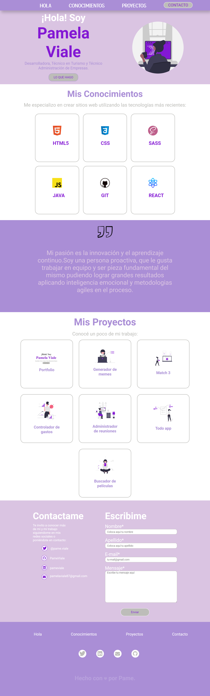

# Portfolio - Pamela Viale

 * ## Presentación 
Hola ! Mi nombre es Pamela Viale,  desarrolladora web en potencia. Actualmente cuento con conocimientos de HTML, CSS Y JAVA. 

Los invito a ver mi portfolio, el cual está en construcción ya que iré completando a lo largo de mi carrera..

* ## Paginas de inspiración

Mi Portfolio es un proyecto  para el curso de programación y esta inspirado en el modelo que Ada nos designó como proyecto y práctica.

<a name="Ada-Porfolio-Inspiración" hreff="https://frontend-proyecto-portfolio.adaitw.org/">Portfolio-Ada- Inspiración</a>

* ## Link para que puedas ver mi trabajo: 
Puedes ver mi trabajo pulsando el siguiente enlace <a name="Proyecto-Porfolio" hreff="http://127.0.0.1:5501/index.html">Portfolio-Pame Viale</a>

* ## Agradecimientos: 
Agradezco a mis profes de curso Macarena Bernal y Mariana Juarez que nos enseñaron y guiaron en esta hermosa carrera 💕

* ## Asi será lo que podrás ver:

